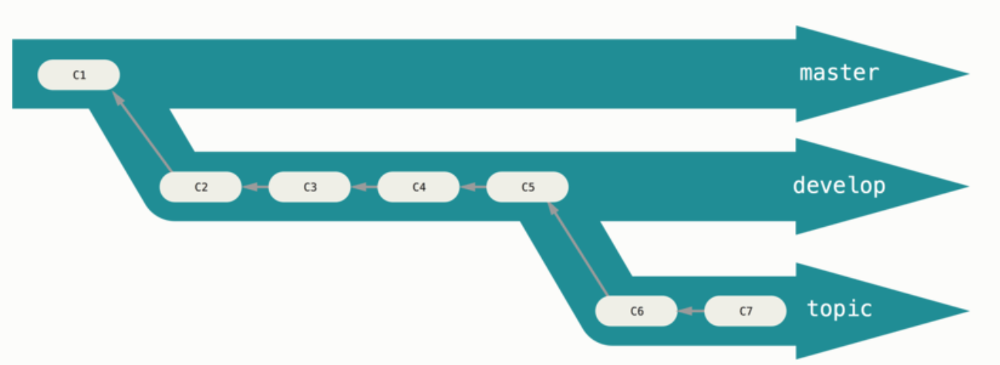

## Standup Schedule
- Tuesday: 2:30pm + collaborative work session
- Wednesday: 6pm
- Thursday: 12:15pm
- Sunday: 9pm

## Rules of Contributing
- Be familiar with our repository and all the files
- Have a clear understanding about the language you are contributing in 
- Code in the style that we have established 
- Be knowledgeable about git commands and agile workflow

## Team Workflow (IN PROGRESS)
We are using a branching development structure:

1) Branch off *master* to *development* branch using the command:  
`git checkout -b development master`  
2) Set an remote upstream branch to `development` using the command:  
`git push origin development`
3) When developing a new feature checkout a branch off *development* called *{FEATURE}* (replacing with the name of your feature ex. logoutbutton)  using command:  
`git checkout -b {FEATURE} development`
4) Set an upstream branch to *{FEATURE}* using the command:  
`git push origin {FEATURE}`   
5) Do work on the *{FEATURE}* branch and then`git add` and `git commit` the files   
6) Switch back to the *development* branch using the command:  
`git checkout dev`  
`git merge --no-ff {FEATURE}`  
7) Push changes on both branches to the server using the commands:  
`git push origin dev`  
`git push origin {FEATURE}`  

### If creating a new feature go back to *Step 3* and repeat

**INSTRUCTIONS IN PROGRESS**

## How to Contribute
1) Fork the **bMusic** repository
2) Clone your forked repository to your local machine
3) Create a branch
4) Push changes to your remote fork
5) Issue a pull request to **bMusic** repository

## Team Norms
We will work together as team with respect, patience and clear communication. If any contention occurs at anytime during the project, we will discuss what our issue is in a non accusatory way, and work to solve the problem. 
#**It is not one person against another, but both people against the problem at hand.**
## What does "Done" mean
Done is when you have the issue at hand has been addressed to the best of the ability of the contributor, including asking for help from teammates, the tutor, and Professor Bloomberg.

## Team Code of Conduct
We do not tolerate harassing or disrespectful behavior, interactions, messages, or images, by any participant in the bMusic team, in any form. This includes business and social activities, regardless of location.
