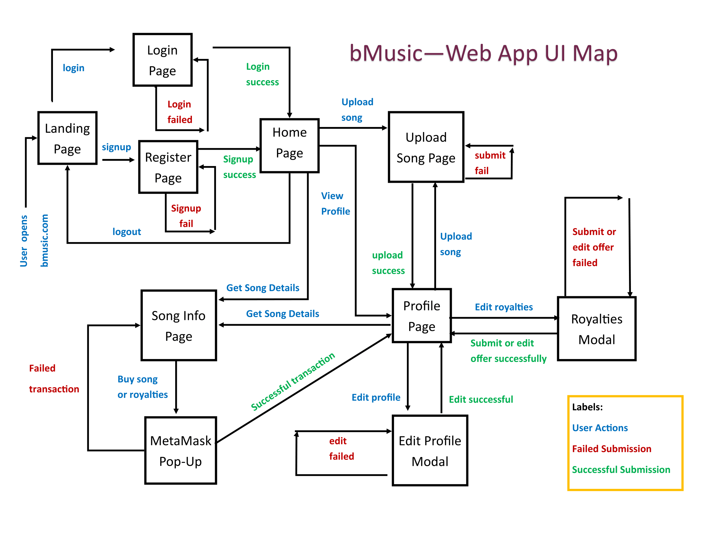
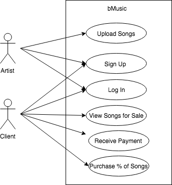

# Requirements
Wireframes
 - ([Artist Profile](https://wireframe.cc/O03Qzz))
 - ([Song Information](https://wireframe.cc/VPFxkU))
 - ([Landing Page](https://wireframe.cc/6OkyTT))
 - ([404 Page](https://wireframe.cc/zwMuRi))
 - ([How to page](https://wireframe.cc/cxDoyN))
 - ([Register Page](https://wireframe.cc/u1w8zQ))
 - ([Login Page](https://wireframe.cc/JMakfm))
 

UI Map

## Interviews 

Our main stakeholders are Amos Bloomberg and Wei Kai. Based on the interviews, some of the things we will have to keep in mind are:

1. The application has to be aesthetically pleasing to appeal to artists 
2. The application has to make the artists' payment process more 
convenient.

## End - User Observation
### Sonya - *Independent Artist* 

**Description**
Sonya Sparkles is independent artist independent artist living in Brooklyn, New York. She is a 22 years old singer and songwriter who records and produces all of her music and gets paid whenever her songs are played or streamed. She is currently waiting tables to make extra cash and would love to have extra source of quick cash that allows her to focus more time on her passion for music. Sonya would greatly benefit from listing her songs on bMusic as this would allow her to sell partial ownership of her songs for quick and immediate cash. Now, instead of wasting her time waiting tables, she can continue making music and receive immediate cash.   

**Needs**
- Dedicate more time to making music and writing songs:
- Achieve quick cash in a legal way 
  
bMusic would perfectly address her needs since it would enable her to list songs for sale in a convenient way and earn quick cash.

### Chris - *Music & Investing Enthusiast*
**Description**
Chris is a 26 years old music enthusiast who works as a marketing analyst in New York. As a marketing analyst, he makes middle-class income and always looks for ways to build up capital and make more money.  As a creative,  person he uses music for inspiration while working on his marketing campaign. bMusic is the perfect way for him to grow his money as he trusts his music taste and believes he can pick which songs will become popular. The ability to select % on each song are the perfect way for him to diversify his portfolio

**Needs**
  - Find alternative and not extremely volatile investing opportunities
  - Use a convenient platform that will allow him to leverage music knowledge and tie value to it
  
bMusic would solve Chris's needs as it is an extra way for him to grow his capital that is alternative to stock investing. It will also allow him to put his good music taste to generate extra income.

## Use Cases 

**Title**: Upload Songs

**Actor**: Artist

Scenario: Artist clicks on a button to upload a song. A modal pops up for artist to enter song name, price and max % of song they are willing to give up. System creates a smart contract given the input and stores the smart contract in a database. System adds the song to listings and closes the modal

**Title**: Sign Up

**Actor**: Artist and Client

**Scenario**: A new user enters the site and clicks “sign up” button. System loads a modal for the new user to enter personal information to register for the bMusic platform. Personal information includes email, name and role (either artist or user). User submits the information and the system stores the information in a database to enable future login.

**Title**: Log In

**Actor**: Artist and Client

**Scenario**: A registered user enters the site and clicks “log in” button. System loads a modal for the user to login information. System checks with the database to verify that the user is registered. If user is registered, system displays home page to user. If use is not registered or the email and password combination is incorrect, system denies user access and prompts them to reenter email and password combination.

**Title**: View Songs up for Sale

**Actor**: Client

**Scenario 1**: Client enters a link to our website homepage into the browser. System loads some songs up for sale into view.

**Scenario 2**: Client is on artist’s profile. Client presses “homepage” button and is directed to the homepage. System loads some songs up for sale into view.

**Scenario 3**: Client enters a link to an artist’s profile into the browser. Client is directed to the artist’s profile, and the system loads up some of that artist’s songs up for sale into view.

**Scenario 4**: Client is on homepage. System loads up some links to artists’ profiles. Client clicks on a link to an artist’s profile, and is directed to that artist’s profile. System uploads some of that artist’s songs up for sale into view.

**Title**: Purchase % of Song

**Actor**: Client

**Scenario**: Client clicks on a song up for sale. System loads a modal containing a purchase form. Client fills out form and presses “submit”. System removes money from client’s wallet and puts that money into wallet of the song’s artist. System updates smart contract of the song. System sends artist notification of the purchase.

## Domain Modeling 

