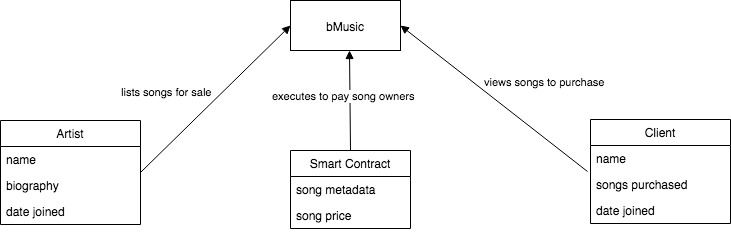

## End - User Observation
- Sonya - Independent Artist 

- Description 

Sonya Sparkles is independent artist independent artist living in Brooklyn, New York. She is a 22 years old singer and songwriter who records and produces all of her music and gets paid whenever her songs are played or streamed. She is currently waiting tables to make extra cash and would love to have extra source of quick cash that allows her to focus more time on her passion for music. Sonya would greatly benefit from listing her songs on bMusic as this would allow her to sell partial ownership of her songs for quick and immediate cash. Now, instead of wasting her time waiting tables, she can continue making music and receive immediate cash. 
- Needs: 
  - dedicate more time to making music and writing songs:
  - ways to achieve quick cash in a legal way 
  
bMusic would perfectly address her needs since it would enable her to list songs for sale in a convenient way and earn quick cash.

- Chris - Music & Investing Enthusiast
- Description

Chris is a 26 years old music enthusiast who works as a marketing analyst in New York. As a marketing analyst, he makes middle-class income and always looks for ways to build up capital and make more money.  As a creative,  person he uses music for inspiration while working on his marketing campaign. bMusic is the perfect way for him to grow his money as he trusts his music taste and believes he can pick which songs will become popular. The ability to select % on each song are the perfect way for him to diversify his portfolio

- Needs:
  - find alternative and not extremely volatile investing opportunities
  - a convenient platform that will allow him to leverage music knowledge and tie value to it
  
bMusic would solve Chris's needs as it is an extra way for him to grow his capital that is alternative to stock investing. It will also allow him to put his good music taste to generate extra income.

## Domain Modeling 
