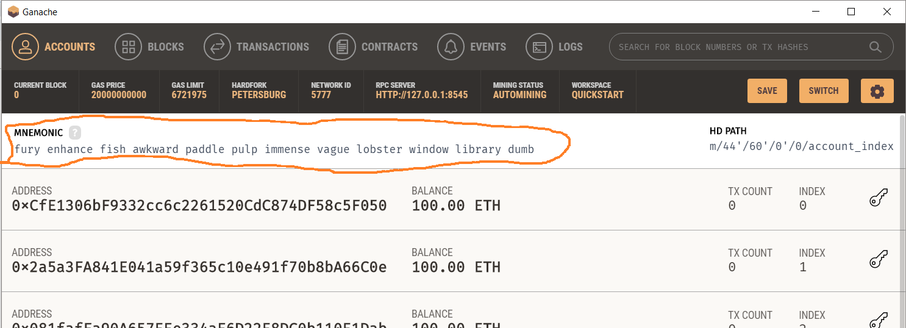

# Steps to work with bMusic

## Testing with MetaMask and Ganache
1. Install MetaMask:
    1. Go to https://metamask.io/
    2. Get your prefered browser extension
    3. Click on install
2. Install Ganache:
    1. Go to https://truffleframework.com/ganache
    2. Download the installer.
    3. Open the downloaded Ganache APPX file
    4. Install it.
    5. Launch Ganache
3.  Set up Ganache:
    1.  In ganache, click on quickstart.
    2.  Go to Settings (the cog icon)
    3.  Go to server, change the port number to 8545.
    4.  Click on Save and Restart
4.  Set Up MetaMask:
    1.  When you click on the MetaMask (the fox) icon for the first time, a new tab will appear
    2.  Click on Get Started
    3.  Click on "I already have a wallet"
    4.  Read the info provided and click on "I agree" (if you agree, ofc)
    5.  In the part where it says import wallet or something like that, you are going to copy paste the mnemonic provided by ganache. (see the image below)
    
    6.  Paste these words in the input and create a personalized password
    7.  Agree to Terms of Use and import the wallet
    8.  Check the info given and click on "Done"
    9.  Now you will see a cool MetaMask account with 0 ETH in Mainnet
    10. Click on the little icon next to where it says "Main Ethereum Network" and go to "Settings"
    11.  Go to Advanced and scroll down to where it says "New Network"
    12.  Click on "Show Advanced Options"
    13.  Where it says "New RPC URL", write the following:
        -     http://localhost:8545
    14. I recommend writing "Ganache Network" where it says "Nickname (optional)". It will make it easier to see which network you are in.
    15. Click "Save". This will automatically change the network to Ganache's network. Now Ganache, your local blockchain, is connected to  MetaMask in your browser.
    16. Click on the MetaMask and see that now you are a proud owner of 100 ETH.
    17. You don't have to keep the tab open. You can close it. To see metamask again, you can click on the icon and you will see a little pop up come up.
    18. **IMPORTANT NOTE:** Absolutely ***ALWAYS***, logout of MetaMask when you are not using it. It's okay when testing with ganache because we are not using real money, but if you leave the session on in another place when in mainnet, logging out of whatever website won't log you out of MetaMask, which means that another person can just go into your computer, open your browser and transfer themselves all your ether.

## Using MetaMask and bMusic

1. You can login or signup regularly.
2. The user must not be logged in to MetaMask upon logging in to the webapp to be able to navigate through it.
3. When the user chooses to upload a song, buy a song, buy royalties, sell royalties, or withdraw a royalty offer, the user will have to be logged into MetaMask.
4. When a one of the previous actions are triggered, let 's say like the user chooses to buy a song, a MetaMask pop up should appear asking for the user's confirmation of the transaction. Upon acceptance of the transaction, the action should takes place. In this case, the user should now be the owner of the song (the audio).
5. It is important for the user to know that only one account will be associated as owner to whatever the user chooses to buy. That is, a user must always use the same account in order to be validated for the song and validate his/her ownership over royalties. We highly recomment the users to only use one ethereum account per profile with bMusic.
